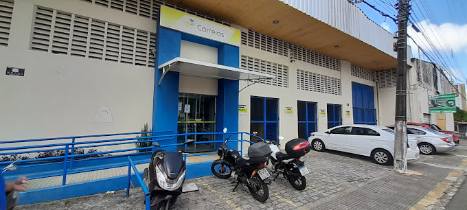
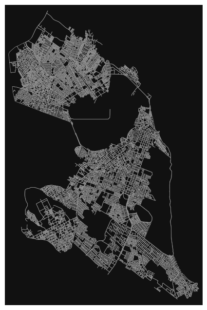
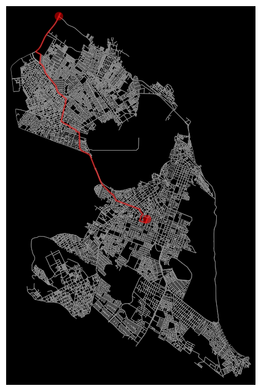

# U1T4 - Package Delivery Logistics

This project uses the OSMnx library to analyze the road network of Natal, Rio Grande do Norte, focusing on metrics that assist in package delivery logistics. The analysis was conducted in the context of Unit 1 (U1T4) work, exploring graph metrics that reveal essential information for planning and route efficiency. The questions addressed aim to optimize delivery operations, considering the structure of the city's road network.

Student: Lucas Freire Costa

Course: Computer Engineering

[Video explaining the project](https://youtu.be/WepBMTJjWHU)

## Overview

From the road network of the city of Natal, several graph analysis metrics were applied to answer critical questions in delivery logistics. The metrics addressed were:

- **Average Shortest Path Length**
- **Diameter of Network**
- **Shortest Path Length**
- **Connected Components**
- **Giant Connected Component**
- **Clustering Coefficient**

In the generated graph, the nodes are the intersections between the streets and the edges are the streets. Thus, the graph used had 18,668 nodes and 48,524 edges.

  
  
<em>Figure 1: Network of Natal</em>

## Main Questions and Answers

The questions below were formulated to explore how graph metrics help optimize package delivery logistics in Natal. Each metric answers specific questions that assist in logistical planning.

### 1. **How accessible are the different areas of the city?**
   - **Metric Used**: Average Shortest Path Length
   - **Explanation**: The average shortest path length indicates the average distance between two points in the road network. In a delivery context, this helps estimate the average distance a delivery person will travel to cover different areas. High values may indicate less accessible areas or fewer direct route options.
   - **Result**: The average shortest path length for the road network of Natal is approximately 10,672 meters. This metric may be high due to distant regions of the city, such as the North Zone and Ponta Negra.

### 2. **What is the shortest path distance to the furthest delivery point from the Correios Package Delivery Center (CEE) in Natal?**
   - **Metric Used**: Shortest Path Length
   - **Explanation**: Using this metric helps answer what the longest distance a delivery person would have to travel to reach the furthest delivery point from the distribution center. This information is useful for predicting the maximum time and cost of a delivery within the covered area and also for planning resources, such as the number of vehicles or travel time.
   - **Result**: The furthest delivery point from the Correios CEE is 16,931 meters away, indicating the longest distance to be traveled for a delivery, which is relevant for understanding the maximum reach of a direct route.

  
  
<em>Figure 2: Shortest Path Length</em>

### 3. **What is the maximum distance between two points in the network?**
   - **Metric Used**: Diameter of Network
   - **Explanation**: The diameter represents the longest possible distance between two nodes in the network, which is essential for understanding the maximum extent of a delivery route. In this context, this metric helps plan routes for remote or less connected areas, where deliveries may take longer. It also helps identify regions or neighborhoods that are further away and contribute to logistics development.
   - **Result**: The network diameter is 30,161 meters, representing the maximum distance between any two points in the city, which helps establish limits for the reach of the most distant deliveries.

### 4. **Which areas of the city are resilient to road blockages?**
   - **Metric Used**: Connected Components and Giant Connected Component
   - **Explanation**: The number of connected components indicates how many sub-networks exist within the main network. The existence of a "Giant Connected Component" shows that a large part of the city is connected and, therefore, resilient to blockages in specific areas, offering several alternative routes.
   - **Result**: The graph has 1 weakly connected component and 18 strongly connected components, with the Giant Connected Component containing 18,668 nodes and 28,140 edges. This indicates that most of the city is connected in such a way that local blockages would not affect overall access, increasing the resilience of the delivery network.

### 5. **How connected are the city's intersections?**
   - **Metric Used**: Clustering Coefficient
   - **Explanation**: The clustering coefficient measures the degree of interconnection between neighboring nodes. In delivery logistics, a high clustering coefficient in certain areas indicates that there are many route options between nearby intersections, allowing greater flexibility and detour options, which is useful for avoiding congestion and optimizing routes.
   - **Result**: The average clustering coefficient of the network is approximately 0.0307, a relatively low value, suggesting that while there are some interconnected areas, most of the city's intersections do not have a high density of direct connections. This reflects a more linear network structure, which limits detour options in certain regions.