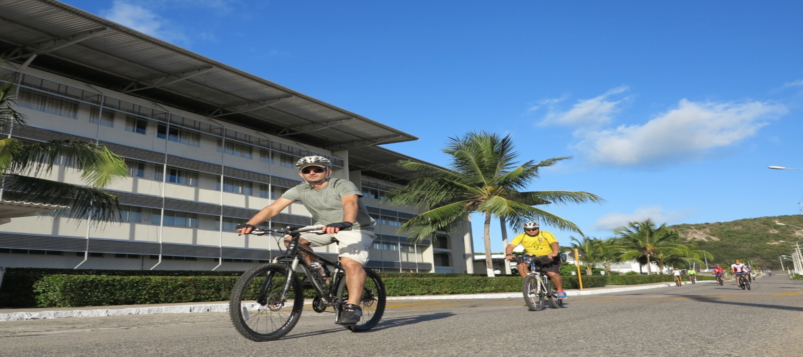
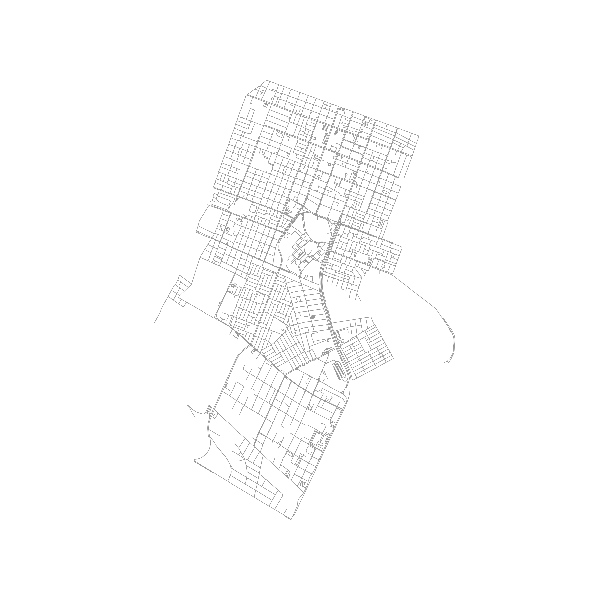
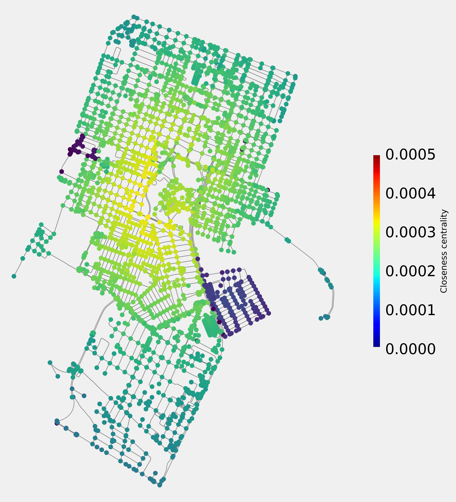
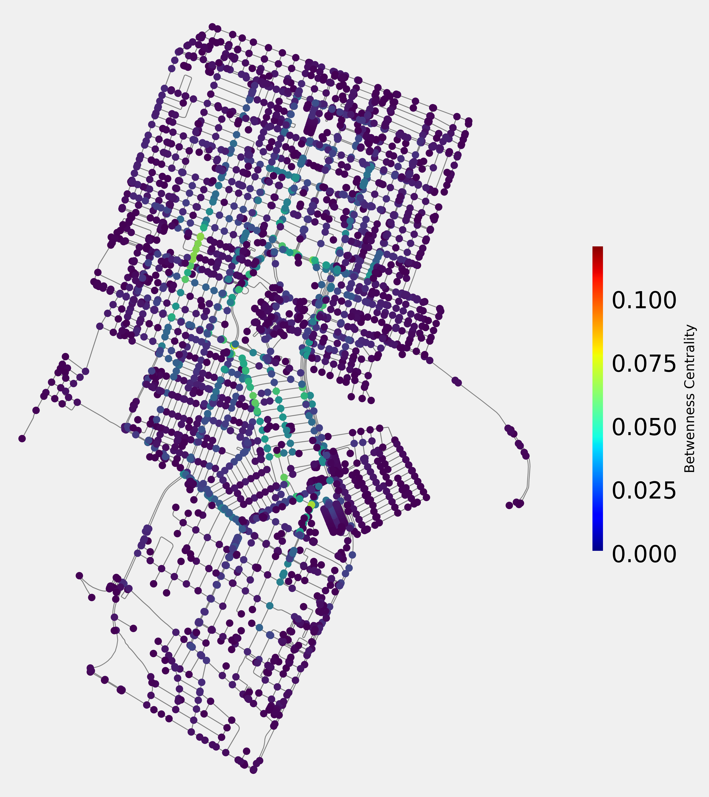
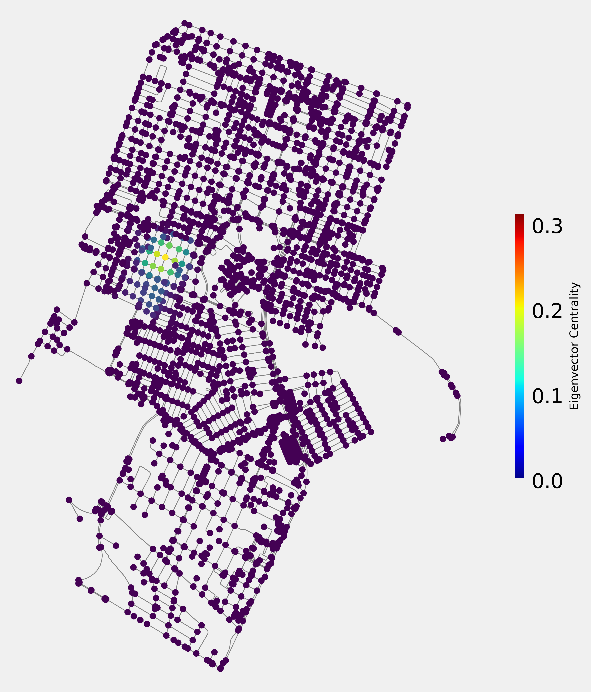
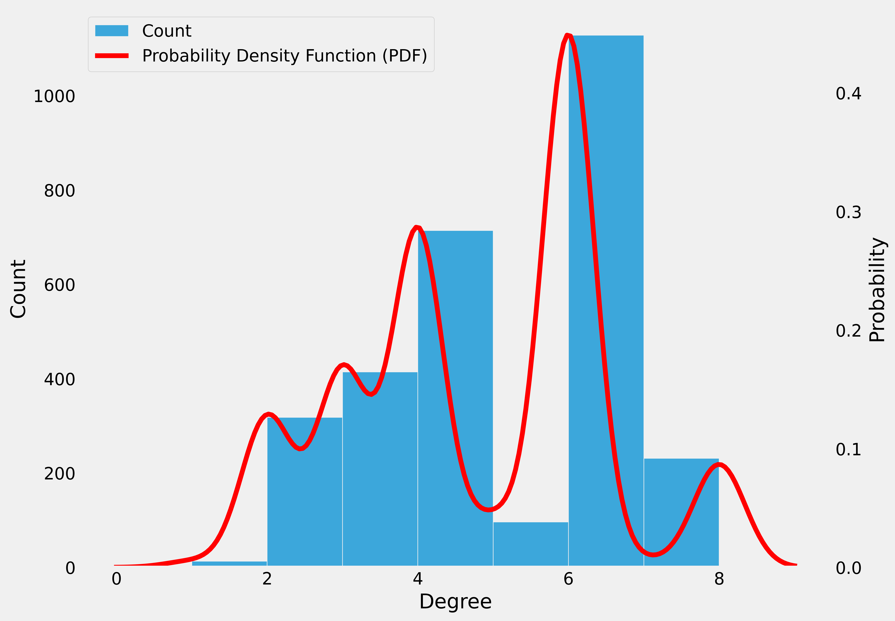
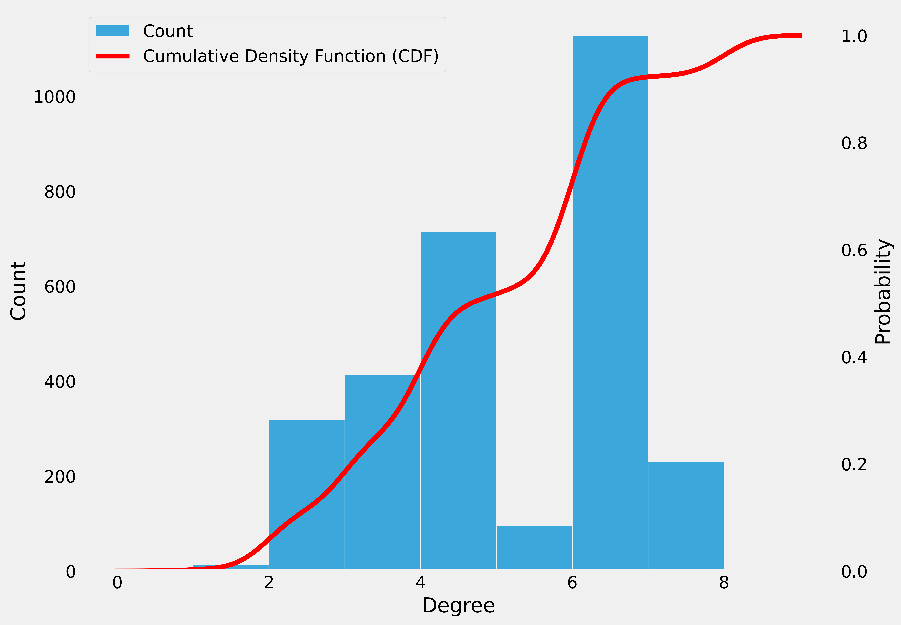

# Mobility Analysis in the Surroundings of UFRN in Natal-RN

This notebook analyzes urban mobility in the surroundings of the Federal University of Rio Grande do Norte (UFRN), in Natal-RN, with the aim of identifying possible locations for the installation of bicycle-sharing stations (dock-stations). For this purpose, various centrality metrics, statistical analysis, and graphical visualization techniques are used.

Student: Lucas Freire Costa

Course: Computer Engineering

[Video explaining the project](https://youtu.be/3DIgTMkJ54A)

## Notebook Structure and Description of Steps

### 1. Environment Setup and Library Loading

The first cell of the notebook imports the necessary libraries for the analysis, such as NetworkX for graph manipulation and OSMNx for road network data extraction. Additionally, libraries for data visualization and statistics are also imported.

### 2. Road Network Data Extraction

In this step, the road network data of the neighborhoods around UFRN are downloaded using OSMNx, excluding nodes within UFRN itself to focus only on the surrounding regions. The neighborhoods of Lagoa Nova, Candelária, and Conjunto Mirassol, which belongs to the Capim Macio neighborhood, were chosen. This road network graph, which allows bicycles, will be the basis for all mobility and centrality analyses in the project.

  
  
<em>Figure 1: Chosen network</em>

### 3. Calculation of Centrality Metrics

To evaluate the importance of each node in the road network and identify strategic locations for the installation of dock-stations, the following centrality metrics are calculated:

- **Degree Centrality**: Measures the number of connections of each node, representing its direct accessibility.
- **Closeness Centrality**: Calculates the average distance to all other nodes in the network, indicating how central a node is relative to the entire network.
- **Betweenness Centrality**: Evaluates the frequency with which a node is traversed by the shortest paths between pairs of nodes, reflecting its importance in connectivity.
- **Eigenvector Centrality**: Measures the importance of a node based on the importance of its neighbors.

  
  
<em>Figure 2: Degree Centrality</em>

**Analysis**: Figure 2 shows the distribution of degree centrality in the road network. Nodes with higher degree centrality are those with more direct connections, indicating locations with high accessibility. These nodes are potential candidates for the installation of dock-stations due to their direct connectivity with other points in the network.

  
  
<em>Figure 3: Closeness Centrality</em>

**Analysis**: Figure 3 illustrates closeness centrality, where nodes with higher values are more centralized relative to the entire network. These nodes can be useful for the problem as they minimize the average distance to all other nodes, facilitating quick access to different parts of the network.

  
  
<em>Figure 4: Betweenness Centrality</em>

**Analysis**: Figure 4 presents betweenness centrality, highlighting nodes that are frequently traversed by the shortest paths between pairs of nodes. These nodes can be strategic points for the installation of dock-stations as they ensure the smooth flow of bicycle traffic.

  
  
<em>Figure 5: Eigenvector Centrality</em>

**Analysis**: Figure 5 shows eigenvector centrality, which measures the influence of a node based on the importance of its neighbors. Nodes with high eigenvector centrality are influential in the network and are good candidates for dock-stations as their importance is amplified by the connectivity of their neighbors.

### 4. Degree Distribution Analysis (CDF and PDF)

To understand the degree distribution in the network, the **probability density function (PDF)** and **cumulative distribution function (CDF)** of the node degrees are calculated and visualized. These analyses help to verify the presence of highly connected nodes, which can be ideal candidates for dock-stations.

  
  
<em>Figure 6: Probability Density Function</em>

Analysis: Figure 6 presents the probability density function (PDF) of the node degrees, showing the connectivity distribution in the network. The PDF curve reveals that most nodes have a low degree, but there are some nodes with significantly higher degrees, indicating that these nodes are hubs in the network. These hubs are points of high connectivity and can be strategic locations for the installation of dock-stations as they offer more possibilities for movement and connectivity in the network.

  
  
<em>Figure 7: Cumulative Density Function</em>

Analysis: Figure 7 illustrates the cumulative distribution function (CDF) of the node degrees. The CDF curve shows that a small percentage of nodes have a very high degree, while most nodes have a low degree. This indicates that the network has some highly connected nodes that act as hubs. Identifying these hubs is crucial for the installation of dock-stations as they ensure greater connectivity and efficiency in the bicycle-sharing network.

### 5. Multivariate Analysis of Centrality Metrics

For a more detailed analysis, the centrality metrics are combined into a table and scatter plots and Kernel Density Estimation (KDE) visualizations are performed. These graphs show how the centralities correlate and help identify patterns among the nodes, facilitating the choice of strategic points for the installation of dock-stations.

  
  
<em>Figure 8: Scatter plots and KDE</em>

Analysis: Figure 8 combines the centrality metrics in scatter plots and KDE graphs. The scatter plots show the relationship between different pairs of centrality metrics, allowing the identification of nodes that are central in multiple metrics. The denser areas in the KDE graphs indicate regions with a higher concentration of nodes with high centrality. These nodes are ideal for the installation of dock-stations as they are important in several metrics, ensuring accessibility (degree centrality), centrality (closeness centrality), connectivity (betweenness centrality), and influence (eigenvector centrality) in the network.

### 6. \( k \)-Core and \( k \)-Shell Analysis

To identify the central and peripheral regions of the network, a **\( k \)-core and \( k \)-shell** decomposition is performed. The \( k \)-core is a maximal subgraph in which all nodes have at least \( k \) connections. Nodes that are part of a higher core are more resilient and central, while peripheral nodes are part of the shells.

  
  
<em>Figure 9: k-core Sociopatterns</em>

Analysis: Figure 9 shows the \( k \)-core decomposition of the network, highlighting the central and peripheral nodes. Nodes that belong to higher cores (cores with higher \( k \) values) are more central and resilient, indicating that they are strategic locations for the installation of dock-stations. These nodes are more connected and have a greater capacity to maintain network connectivity even if some nodes are removed. Therefore, installing dock-stations in these locations can ensure greater robustness and efficiency in the bicycle-sharing network.

---

## Conclusion and Suggestions for Dock-Station Installation

The analyses conducted allowed the identification of central and strategically well-located nodes in the network, which would be ideal for the installation of dock-stations. Based on the centrality metrics, especially betweenness and closeness centrality, it is recommended to position the bicycle-sharing stations near the nodes with the highest values in these metrics. This will ensure that the stations are located at points of high accessibility and connectivity, facilitating the efficient use of the bicycle-sharing system and promoting more sustainable and integrated urban mobility in the surroundings of UFRN.

---