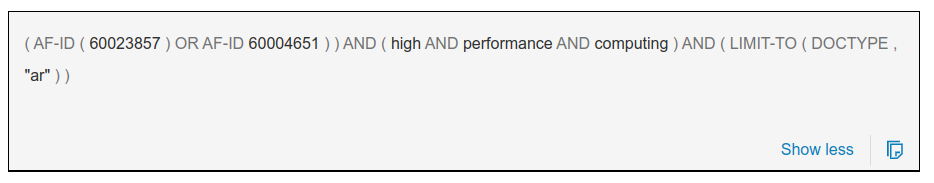
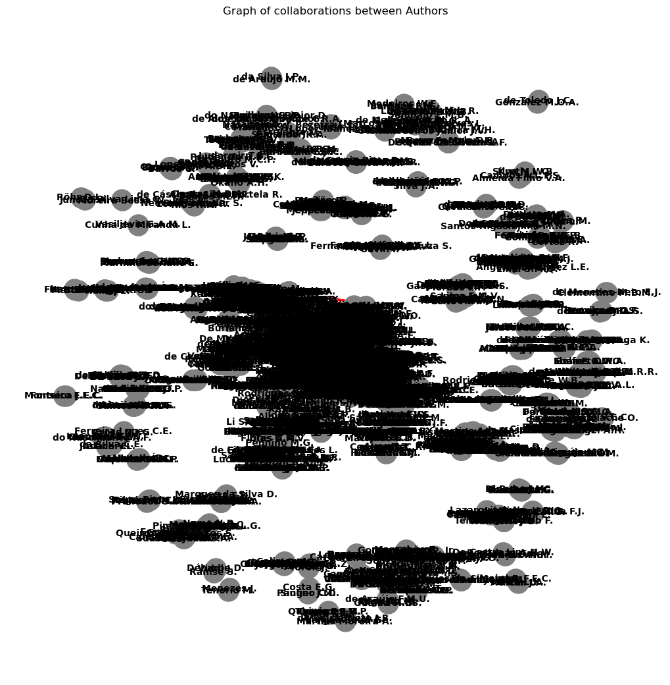
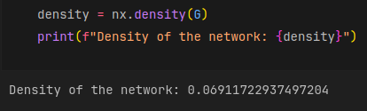
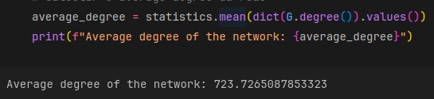
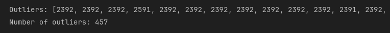
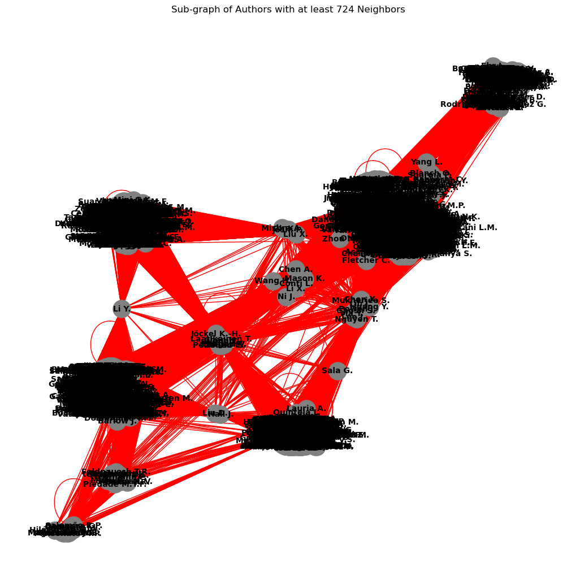
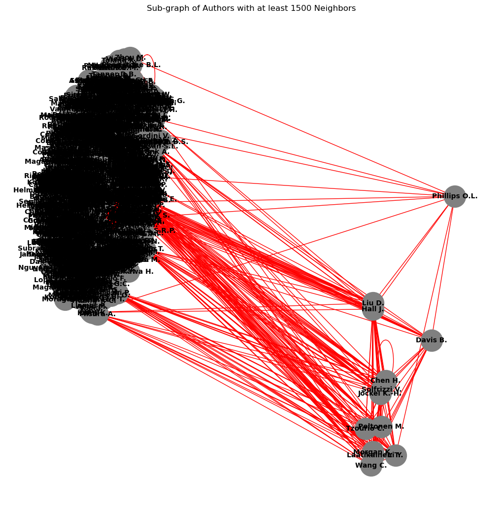
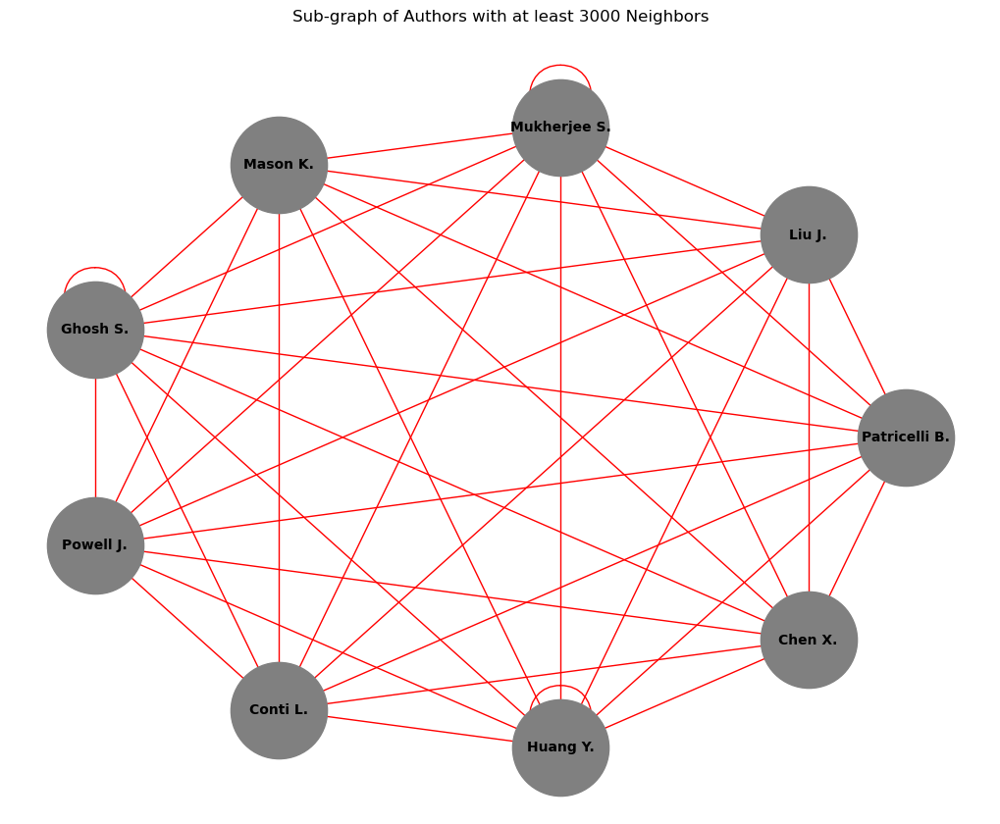
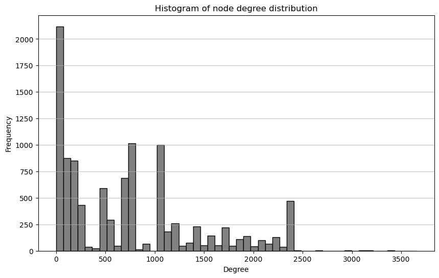

# Coauthor network

The goal of this project was to create and analyze a co-authorship network among authors from the Federal University of Rio Grande do Norte (UFRN), using graph concepts and the NetworkX library in Python. The project was developed using real data extracted from the [Scopus](https://www.elsevier.com/products/scopus) platform, providing an opportunity to apply graph theory in a practical scenario of academic collaboration.

Student: Lucas Freire Costa

Course: Computer Engineering

[Video explaining the project](https://youtu.be/edhqiV4XZJ4)

## General Objective

The activity aimed to reinforce graph concepts by constructing a co-authorship network. Each author was represented as a vertex in the graph, and edges were created between authors who collaborated on the same paper. The work involved data processing, building the co-authorship graph, and performing analyses on the network's structure.

## Data export

The data used were extracted from the Scopus platform, containing information about articles published by UFRN authors. The CSV file included the following columns:

- Authors' names
- Authors' unique identifiers
- Article title
- Year of publication

These data served as the basis for building the collaboration network.

  
  
<em>Figure 1: Filter used in Scopus</em>

## Construction of the Co-Authorship Network

The co-authorship network was created from the processed data, where each vertex represents an author, and edges indicate co-authorship on articles. For example, if three authors collaborated on a paper, edges were created between all pairs of authors, forming a complete graph for that paper.

  
  
<em>Figure 2: Graph of collaborations between authors</em>

Figure 2 shows the complete co-authorship network among authors. Each node represents an author, and each edge represents a collaboration on a paper.

## Analyses Performed

Several analyses were carried out on the created network:

- **Network Density**: The density, which measures how connected the authors are relative to the maximum possible number of connections, was calculated to evaluate the level of collaboration in the network.

  
  
<em>Figure 3: Density of the network</em>

- **Average Degree**: The average degree of a graph represents the average number of connections (or co-authors) each author has. It provides insight into the overall level of collaboration within the network. A higher average degree suggests that authors tend to work with a larger number of co-authors, indicating strong collaboration across the network.

  
  
<em>Figure 4: Average degree of the network</em>

- **Outliers**: There are authors who have an unusually high or low number of co-authors compared to the majority. Authors with very high degrees may be central figures in their academic fields, collaborating extensively, while those with very low degrees may work in more isolated or niche areas.

  
  
<em>Figure 5: Some outliers of the network</em>

- **Sub-graphs**: Three subgraphs were generated with a minimum number of neighbors set to 724, 1500, and 3000, respectively. The goal was to identify the authors with the highest number of collaborations. By progressively increasing the threshold, we could analyze the most collaborative individuals in the network. 

  
  
<em>Figure 6: Subgraph with at least 724 neighbors</em>

  
  
<em>Figure 7: Subgraph with at least 1500 neighbors</em>

  
  
<em>Figure 8: Subgraph with at least 3000 neighbors</em>

- **Degree histogram**: A histogram was created to show the degree distribution of the vertices in the network, indicating how many co-authors each author has.

  
  
<em>Figure 9: Degree histogram</em>

