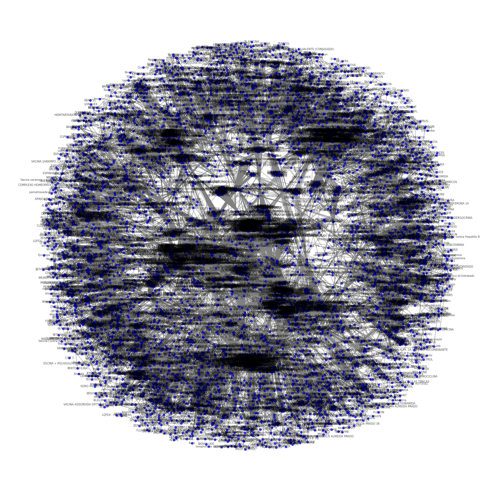
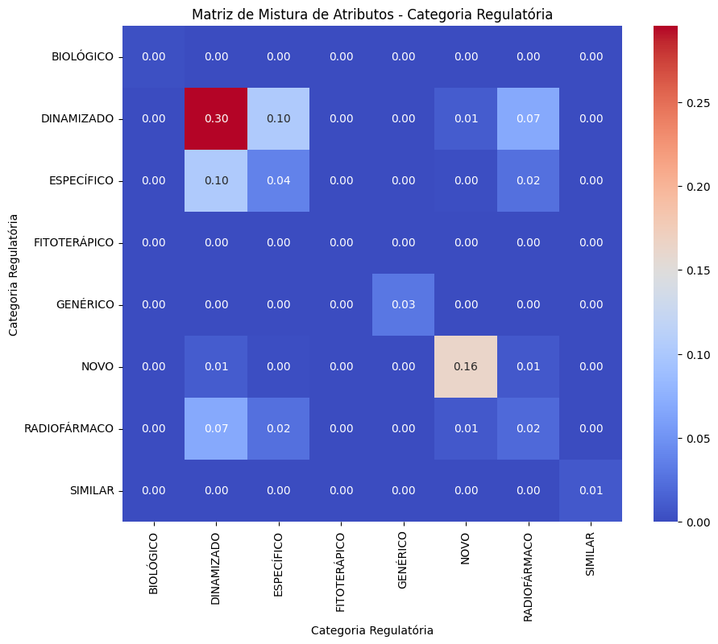
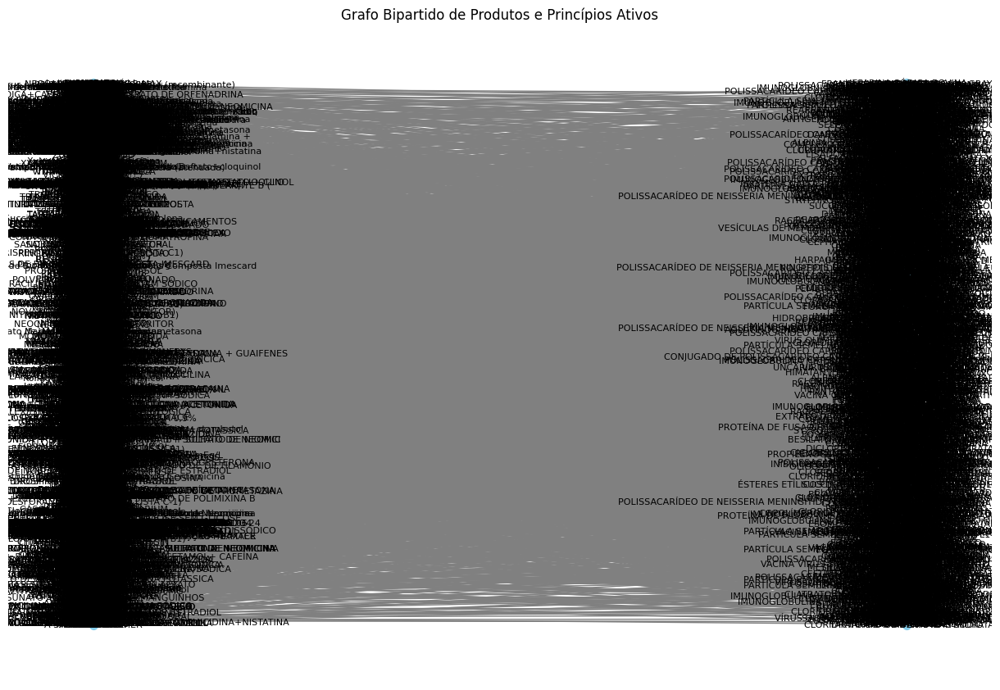
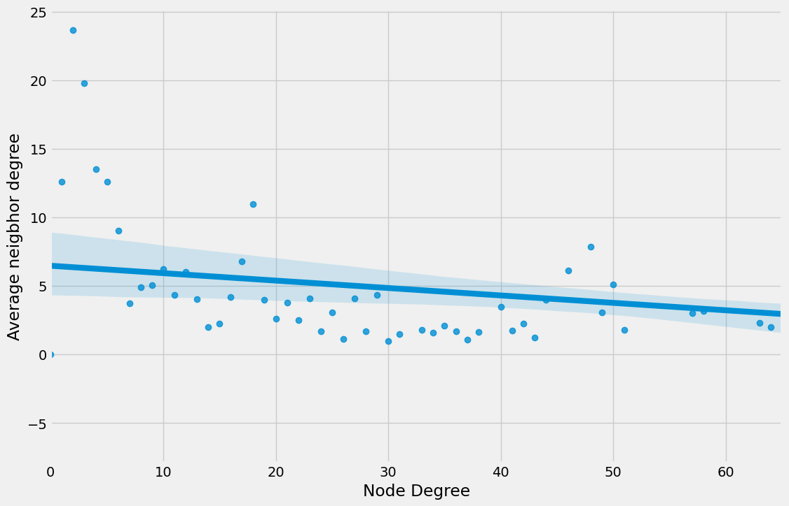
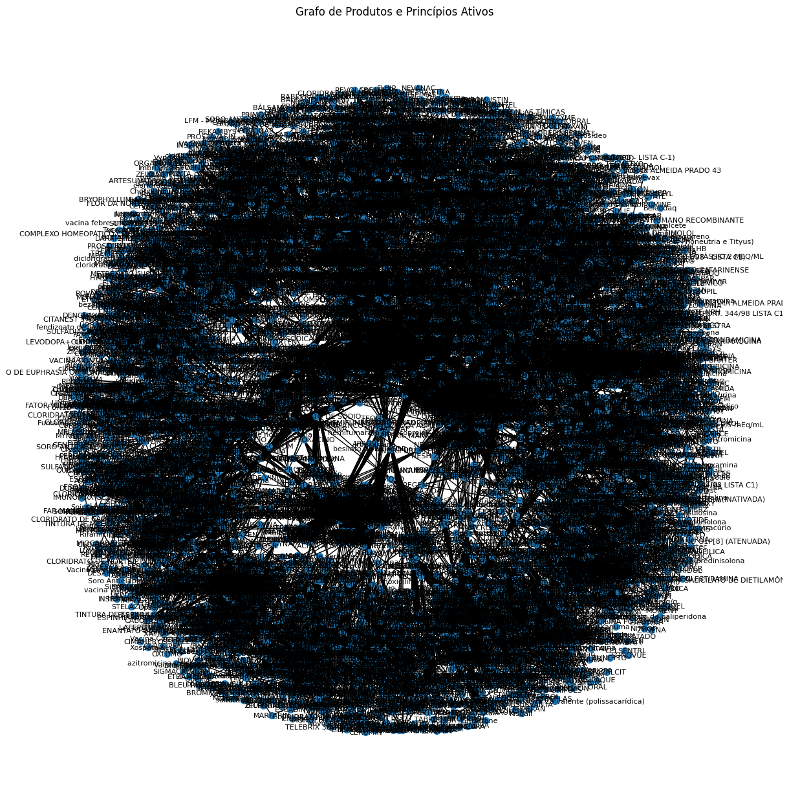

# Study of Assortativity in a Network of Medicines and Active Ingredients

Student: Lucas Freire Costa

Course: Computer Engineering

[Video explaining the project](https://youtu.be/yVpEWbIPVyQ)

# Network #01

## Co-occurrence of Active Ingredients among Medications

- Nodes (vertices): Each medication is represented by a node.

- Edges: An edge exists between two medications if they share at least one active ingredient.

- Assortativity: Calculate the assortativity based on the regulatory category of the medications.

Question to be answered:

- Do medications in the same regulatory category tend to share active ingredients?

Answer: Based on the assortativity calculation, it can be stated that they do not.

  
  
<em>Figure 1: Graph of network 1</em>

# Network #02

## Bipartite Graph of Medications and Active Ingredients

- Nodes (vertices): Medications and active ingredients are distinct nodes.

- Edges: An edge connects a medication to its respective active ingredients.

- Assortativity: Calculate degree assortativity within the bipartite graph to determine if active ingredients connected to complex medications (with many active ingredients) also tend to connect to medications with similar complexity profiles.

Question to be answered:

- Do active ingredients shared by complex medications tend to connect to medications with similar complexity profiles?

Answer: Based on the calculated degree assortativity within the bipartite graph, it can be stated that they do not. In fact, the opposite occurs: the more complex the medication, the less it tends to connect with other medications.

  
  
<em>Figure 2: Mixing matrix of network 2</em>

  
  
<em>Figure 3: Graph of network 2</em>

# Network #03

## Co-occurrence by Company or Therapeutic Class

- Nodes: Each medication is represented by a node.
- Edges: An edge exists between two medications if they share at least one active ingredient.
- Assortativity: Calculate the assortativity based on the company or therapeutic class of the medications.

Question to be answered:

- Do medications from the same company or therapeutic class tend to share active ingredients?

Answer: After calculating the assortativity based on the company and therapeutic class, it was possible to conclude that medications from the same company do NOT tend to share more active ingredients. However, medications from the same therapeutic class tend to share a relatively large number of active ingredients.

  
  
<em>Figure 4: Plot of netkwork 2</em>

  
  
<em>Figure 5: Graph of network 3</em>

