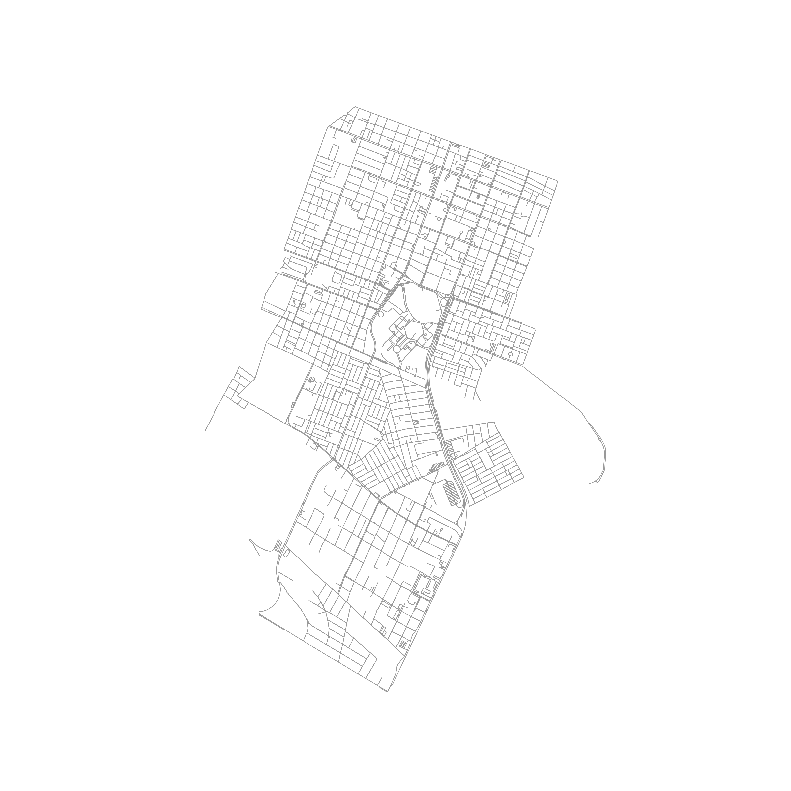
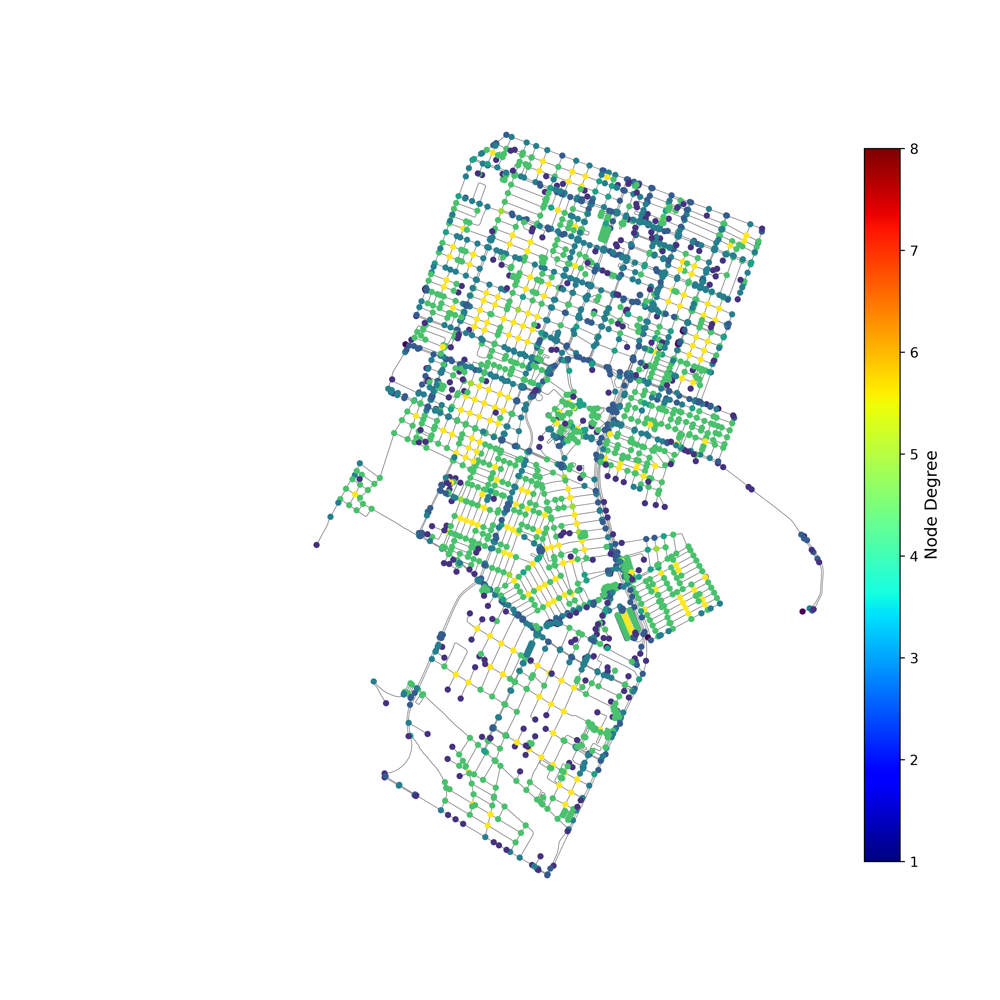
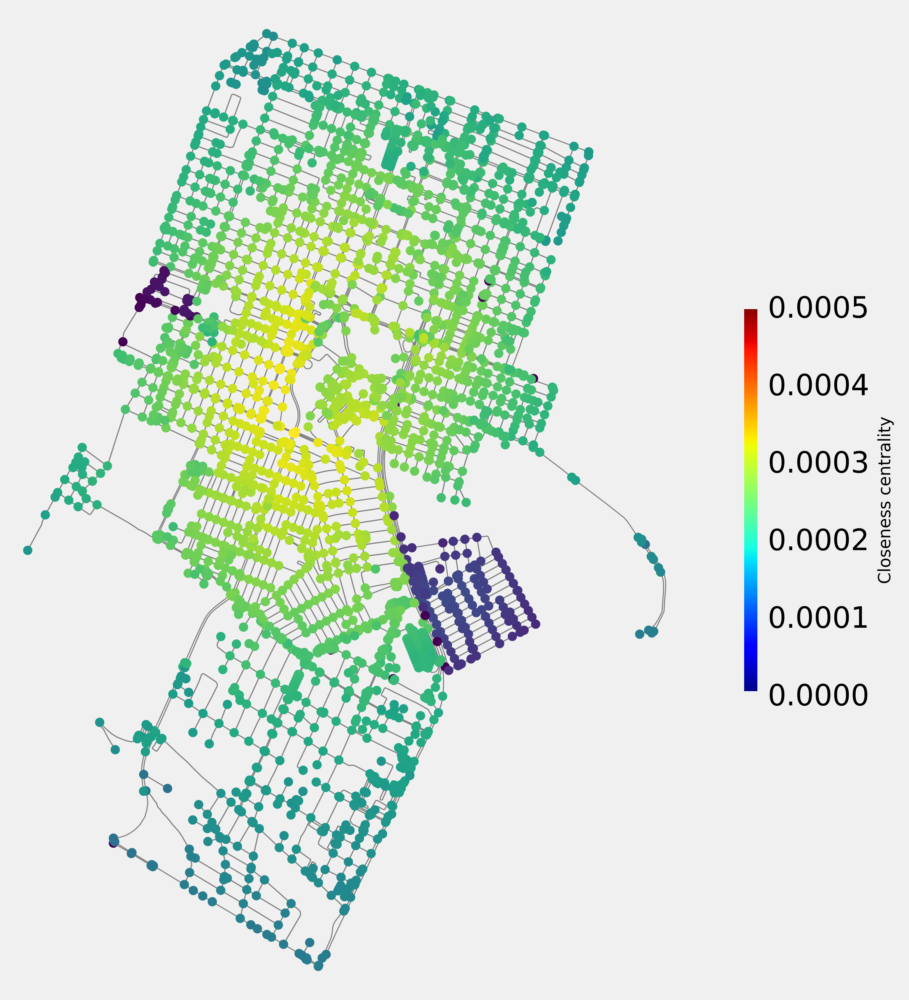
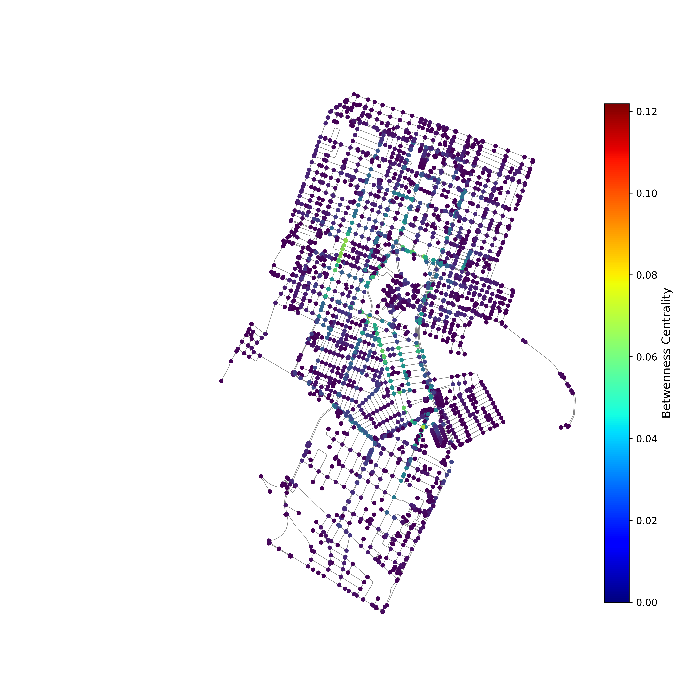
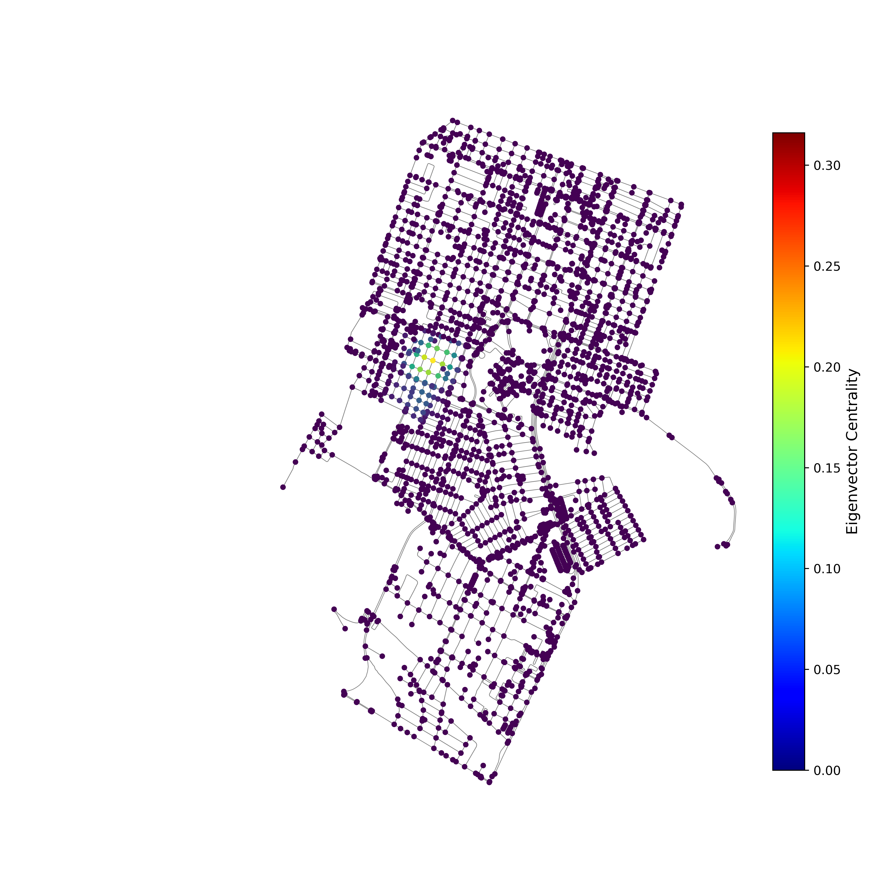

# Análise da Mobilidade no Entorno da UFRN em Natal-RN

Este notebook analisa a mobilidade urbana no entorno da Universidade Federal do Rio Grande do Norte (UFRN), em Natal-RN, com o objetivo de identificar possíveis locais para instalação de estações de compartilhamento de bicicletas (dock-stations). Para isso, são utilizadas diversas métricas de centralidade, análise estatística e técnicas de visualização gráfica.

Student: Lucas Freire Costa

Course: Computer Engineering

[Video explaining the project](https://youtu.be/)

## Estrutura do Notebook e Descrição das Etapas

### 1. Preparação do Ambiente e Carregamento de Bibliotecas

A primeira célula do notebook realiza a importação das bibliotecas necessárias para a análise, como NetworkX para manipulação de grafos e OSMNx para a extração de dados de rede viária. Além disso, também são importadas bibliotecas para visualização de dados e estatísticas.

### 2. Extração dos Dados de Rede Viária

Nesta etapa, os dados da rede viária dos bairros ao redor da UFRN são baixados utilizando OSMNx, excluindo nós da própria UFRN para focar apenas nas regiões do entorno. Foram escolhidos os bairros de Lagoa Nova, Candelária e o Conjunto Mirassol, que pertence ao bairro de Capim Macio. Este grafo de rede viária, que permiite bicicleatas, será a base para todas as análises de mobilidade e centralidade do projeto.

  
  
<em>Figura 1: Rede escolhida</em>

### 3. Cálculo das Métricas de Centralidade

Para avaliar a importância de cada nó na rede viária e identificar locais estratégicos para a instalação de dock-stations, são calculadas as seguintes métricas de centralidade:

- **Degree Centrality**: Mede o número de conexões de cada nó, representando sua acessibilidade direta.
- **Closeness Centrality**: Calcula a média das distâncias para todos os outros nós da rede, indicando o quão central é um nó em relação a toda a rede.
- **Betweenness Centrality**: Avalia a frequência com que um nó é atravessado pelos caminhos mais curtos entre pares de nós, refletindo sua importância na conectividade.
- **Eigenvector Centrality**: Mede a importância de um nó baseado nas importâncias dos seus vizinhos.

  
  
<em>Figura 2: Degree Centrality</em>

  
  
<em>Figura 3: Closeness Centrality</em>

  
  
<em>Figura 4: Betweenness Centrality</em>

  
  
<em>Figura 5: Eigenvector Centrality</em>

### 4. Análise da Distribuição dos Graus (CDF e PDF)

Para compreender a distribuição dos graus na rede, são calculadas e visualizadas as **funções densidade de probabilidade (PDF)** e **distribuição cumulativa (CDF)** dos graus dos nós. Essas análises ajudam a verificar a presença de nós altamente conectados, que podem ser candidatos ideais para as dock-stations.

  
  
<em>Figura 6: Probability Density Function</em>

  
  
<em>Figura 7: Cumulative Density Function</em>

### 5. Análise Multivariada das Métricas de Centralidade

Para uma análise mais detalhada, as métricas de centralidade são combinadas em uma tabela e são realizadas visualizações de dispersão (scatter plots) e Kernel Density Estimation (KDE). Esses gráficos mostram como as centralidades se correlacionam e ajudam a identificar padrões entre os nós, facilitando a escolha de pontos estratégicos para a instalação das dock-stations.

  
  
<em>Figura 8: Plots scatter e KDE</em>

### 6. Análise de \( k \)-Core e \( k \)-Shell

Para identificar as regiões centrais e periféricas da rede, é realizada uma decomposição em **\( k \)-core e \( k \)-shell**. O \( k \)-core é um subgrafo máximo no qual todos os nós têm pelo menos \( k \) conexões. Nós que fazem parte de um core mais elevado são mais resilientes e centrais, enquanto os nós da periferia fazem parte dos shells.

  
  
<em>Figura 9: k-core Sociopatterns</em>

---

## Conclusão e Sugestões para Instalação de Dock-Stations

As análises realizadas permitiram identificar nós centrais e estrategicamente bem localizados na rede, que seriam ideais para a instalação de dock-stations. Baseando-se nas métricas de centralidade, especialmente na centralidade de intermediação e de proximidade, recomenda-se posicionar as estações de compartilhamento de bicicletas próximas aos nós com maiores valores nessas métricas, garantindo acessibilidade e conectividade.

---