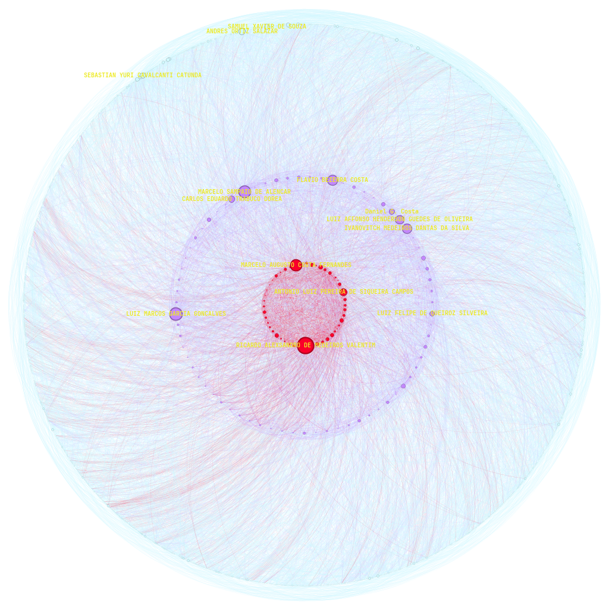

# Co-authorship network

The objective of this project is to use [Gephi](https://gephi.org/) to apply the knowledge acquired during the course by analyzing the co-authorship network of the permanent professors of the Graduate Program in Electrical and Computer Engineering (PPgEEC). 

Students: Lucas Freire Costa and Hipólito Filipe Costa De Araújo

Course: Computer Engineering

[Video explaining the project](https://youtu.be/)

  
  
<em>Figure X: Core </em>

