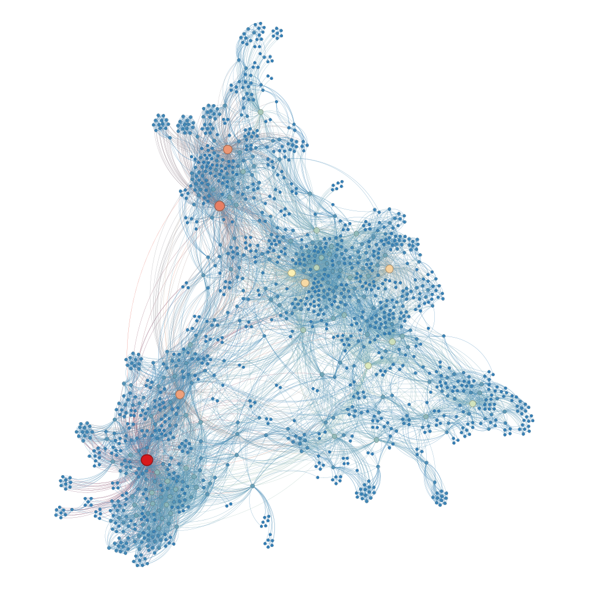
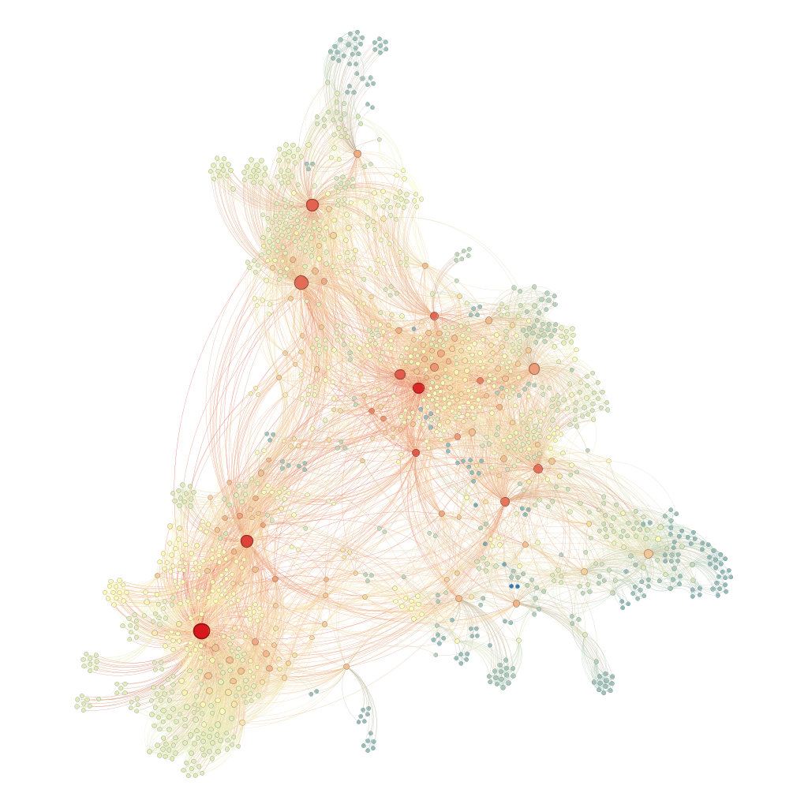
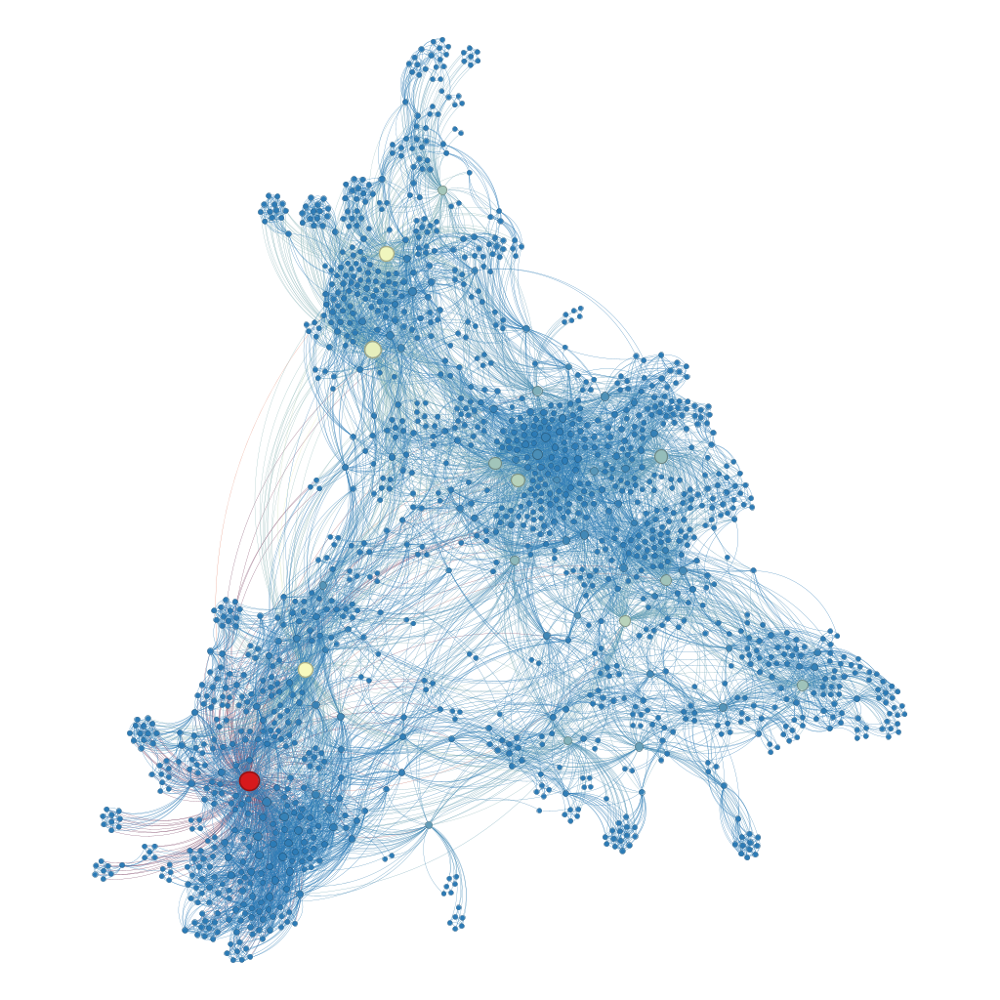
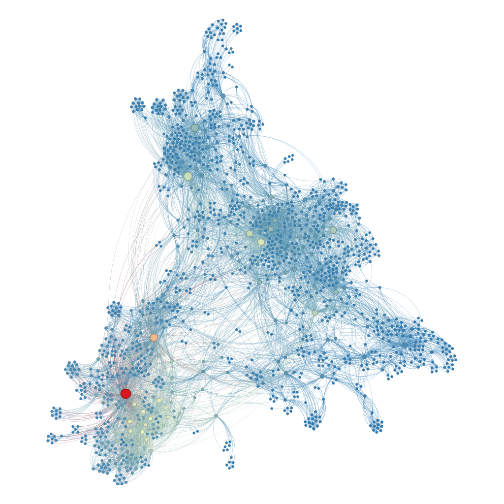

# Co-authorship network

The objective of this project is to use [Gephi](https://gephi.org/) to apply the knowledge acquired during the course by analyzing the co-authorship network of the permanent professors of the Graduate Program in Electrical and Computer Engineering (PPgEEC). 

Students: Lucas Freire Costa and Hipólito Filipe Costa De Araújo

Course: Computer Engineering

[Video explaining the project](https://youtu.be/)

## Part 1: Centrality Metrics Visualization

This section presents visualizations of centrality metrics applied to the co-authorship network. The metrics were used to size and color the nodes, highlighting important properties of the network structure.

1. **Degree Centrality**: The node size represents the number of direct neighbors (*degree*).  
2. **Closeness Centrality**: The colors highlight the proximity of a node to all others in the network.  
3. **Betweenness Centrality**: Indicates the nodes that act as bridges in the network.  
4. **Eigenvector Centrality**: Highlights nodes connected to other highly influential nodes.  

The node size is proportional to its degree, and the visualization layout used was *Force Atlas 2*. Warmer colors indicate higher metric values for the corresponding nodes.  

  
  
<em>Figure 1: Degree Centrality </em>

**Degree Centrality** measures the number of direct connections each node has in the network, which, in this case, corresponds to the number of co-authors each author has. This means that authors with higher centrality play a central role in the co-authorship network by collaborating with many other authors. These individuals often act as connection facilitators, promoting the dissemination of projects across different groups within the network. In the presented co-authorship network, larger nodes with warmer colors, such as red, represent the most active authors in terms of collaboration. These authors not only lead in the number of co-authors but also play an important role in maintaining the network's cohesion by connecting its various parts. Additionally, the density of nodes and edges in certain regions of the network suggests the presence of groups or communities of authors who frequently collaborate. On the other hand, authors located in more peripheral regions tend to have fewer connections, indicating lower interaction with the rest of the network (These are probably the students who only wrote 1 article).

  
  
<em>Figure 2: Closeness Centrality </em>

**Closeness Centrality** measures how close a node is to all other nodes in the network. Nodes with high closeness centrality can quickly interact with all other nodes, indicating their strategic position within the network. In the co-authorship network, nodes with warmer colors represent authors who can efficiently disseminate information and collaborate across the network. These authors are crucial for the rapid spread of ideas and knowledge, acting as central hubs that facilitate communication and collaboration among different groups.

  
  
<em>Figure 3: Betweenness Centrality </em>

**Betweenness Centrality** identifies nodes that act as bridges within the network. These nodes are critical for maintaining the flow of information between different parts of the network. In the co-authorship network, authors with high betweenness centrality are those who connect disparate groups of authors, enabling collaboration and knowledge sharing across the network. These authors often hold strategic positions that can influence the network's structure and the dissemination of research.

  
  
<em>Figure 4: Eigenvector Centrality </em>

**Eigenvector Centrality** measures a node's influence based on its connections to other highly influential nodes. In the co-authorship network, authors with high eigenvector centrality are not only well-connected but also connected to other well-connected authors. This metric highlights the most influential authors who have significant reach and impact within the network. These authors play a key role in shaping the research landscape and driving collaborative efforts across the network.

## Part 2: k-core and k-shell

  
  
<em>Figure 5: Core </em>

## Part 3: Network production

For this visualization, the **node size** was determined by the **h-index** of each author, which measures both the productivity and the impact of their publications. Larger nodes represent authors with higher h-index values, indicating greater academic influence.  

The network's **communities** were identified and divided using the **modularity optimization algorithm** proposed by Vincent D. Blondel, Jean-Loup Guillaume, Renaud Lambiotte, and Etienne Lefebvre in their work *Fast unfolding of communities in large networks* (Journal of Statistical Mechanics: Theory and Experiment, 2008). This algorithm detects communities by maximizing the modularity metric, effectively grouping nodes that are more densely connected to each other than to the rest of the network.  

This approach highlights clusters of authors who collaborate more frequently, revealing distinct research groups or collaborative networks within the co-authorship structure. Combining the h-index with community detection provides insights into individual influence and the overall collaborative dynamics of the network.

[Link to the network](https://lucasfreirec.github.io/datastructure/U2/U2T1/network/)