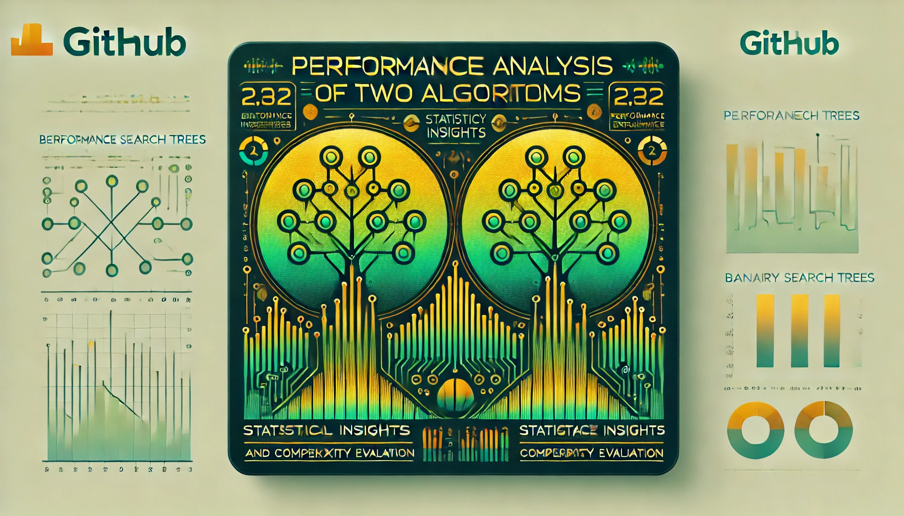
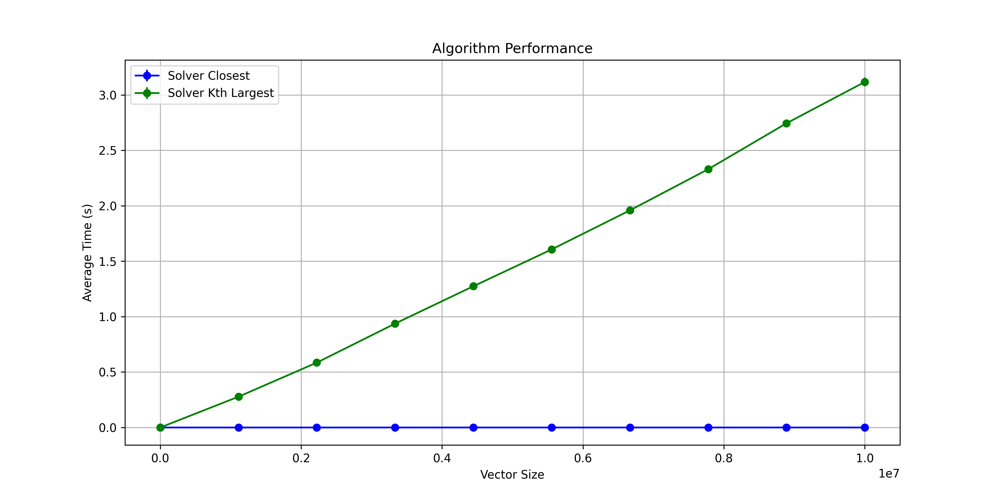
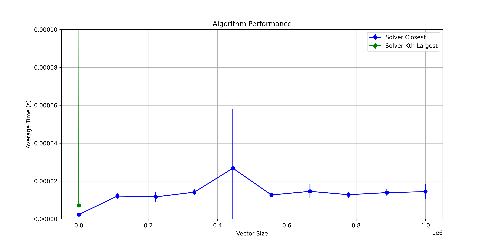

*Generated by DALL-E*

# Performance Analysis of Two Algorithms

The objective of this project is to evaluate the performance of two algorithms using statistical analysis and graphical visualizations. The algorithms under study are `solver_closest` and `solver_kth_largest`, both implemented using the Binary Search Tree (BST) data structure.

Student: Lucas Freire Costa

Course: Computer Engineering

[Video explaining the project](https://youtu.be/example_link)

## Notebook Structure and Step-by-Step Description

### 1. Environment Setup and Definition of the Algorithms

The notebook starts by importing the necessary libraries, such as NumPy, Matplotlib, and SciPy for statistical calculations and plotting graphs. The recursion limit is adjusted to accommodate large data structures.

Two algorithms were defined:

- `solver_closest(tree, target)`: Finds the value in the BST closest to the target value.
- `solver_kth_largest(tree, k)`: Finds the k-th largest value in the BST.

These algorithms use helper functions to traverse the tree and compare values.

### 2. Performance Test Configuration and Execution

Parameters were defined for the performance tests:

- `N = 10000000`: Maximum size of the data.
- `steps = 10`: Number of different sizes to be tested.
- `executions_per_size = 10`: Number of executions for each size to obtain average times.

Random data arrays are generated, and the BST is populated accordingly.

For each size in `vector_sizes`, both algorithms are executed multiple times. Execution times are recorded for statistical analysis.

### 3. Statistical Analysis and Confidence Intervals

For each algorithm and input size, the following statistical analyses were performed:

- **Average Execution Time**: Calculated by summing all execution times for a specific input size and dividing by the number of executions. This provides the mean performance metric for that size.
  
    $$
    \bar{t} = \frac{1}{n} \sum_{i=1}^{n} t_i
    $$
    
    where \( t_i \) is the execution time of the \( i \)-th run, and \( n \) is the total number of executions.

- **Standard Deviation**: Measures the dispersion of the execution times around the mean, indicating the variability in performance.
  
    $$
    s = \sqrt{\frac{1}{n - 1} \sum_{i=1}^{n} (t_i - \bar{t})^2}
    $$

- **Confidence Intervals (95%)**: Estimated using the t-Student distribution due to the sample size and unknown population standard deviation. The confidence interval provides a range where the true mean execution time is likely to lie with 95% certainty.
  
    $$
    \text{CI} = \bar{t} \pm t_{\alpha/2, \, n - 1} \times \frac{s}{\sqrt{n}}
    $$
    
    - \( \bar{t} \): Sample mean of execution times.
    - \( s \): Sample standard deviation.
    - \( n \): Number of executions.
    - \( t_{\alpha/2, \, n - 1} \): t-score from the t-distribution table for a 95% confidence level and \( n - 1 \) degrees of freedom.

- **Interpretation**: The use of the t-Student distribution accounts for the variability in small sample sizes and provides a more accurate confidence interval than using a normal distribution. The calculated confidence intervals help in understanding the reliability of the average execution times and in comparing the performance of the two algorithms.

### 4. Visualization of Results

  
  
<em>Figure 1: Comparison of algorithm performances</em>

  
  
<em>Figure 2: Comparison of algorithm performance with the smaller y-axis scale</em>

### 5. Conclusion

The performance evaluation of the algorithms `solver_closest` and `solver_kth_largest` confirmed the expected complexities for each. The `solver_closest` algorithm, which searches for the closest value in a BST, has logarithmic complexity O(log n), as it reduces the search space by half at each step following the tree structure. This is evidenced in the graphs ("grafico1.png" and "grafico2.png"), where the execution time increases slowly as the data size grows.

In contrast, the `solver_kth_largest` algorithm, which finds the k-th largest value in the BST, has linear complexity O(n), since it needs to traverse all the nodes of the tree to collect and sort the elements. The graphs show a proportional increase in execution time with the increase in data size, confirming the expected linear behavior.

The visual results of the graphs clearly reflect these differences in complexity. While the execution time of `solver_closest` exhibits a gentle growth, that of `solver_kth_largest` grows more sharply. The statistical analysis reinforces these observations, pointing to the consistency of the execution times with the theoretical complexities of the algorithms.
