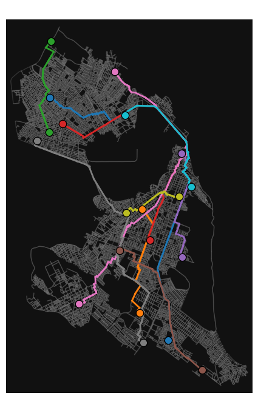
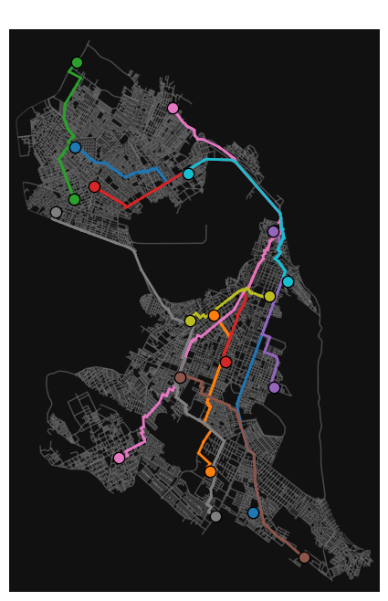

# Comparison of Shortest Path Algorithms

Student: Lucas Freire Costa

Course: Computer Engineering

    

This project demonstrates a comparison between the `shortest_path` function from NetworkX and a manually implemented function called `dijkstrasAlgorithmWithPaths`. The goal is just a visual comparison.

## Notebook Structure

- Obtaining the desired city graph with OSMNx.  
- Generating pairs of randomly chosen origin and destination nodes.  
- Using NetworkX’s native function (`shortest_path`) to evaluate the shortest path.  
- Using the custom `dijkstrasAlgorithmWithPaths` function to find routes between the same node pairs.  
- Graphical visualization to compare the resulting paths.  
- Conclusions regarding possible differences and performance.

## Detailed Topics

### Obtaining the Desired City Graph with OSMNx
In this step, the OSMNx library is used to query and download the street graph of the chosen region. This creates a graph object that allows analysis and manipulation for finding shortest paths.

### Generating Random Pairs of Origin and Destination Nodes
To evaluate the effectiveness of the algorithms, a set of origin and destination nodes is chosen randomly. This ensures variety in test scenarios, making it easier to compare shortest path functions.

### Using NetworkX’s Native Function (`shortest_path`) to Evaluate the Shortest Path
The standard NetworkX function is employed to compute optimized routes. This approach serves as a reference for measuring the efficiency and correctness of the alternative method.

### Using the Custom Implementation (`dijkstrasAlgorithmWithPaths`) to Find Routes Between the Same Node Pairs
This section tests the manually implemented shortest path solution. The focus is on comparing results and performance, observing whether the custom function generates similar routes to the native function.

### Visualization and Conclusions
At this stage, we note that the paths found by the native NetworkX function (`shortest_path`) and the `dijkstrasAlgorithmWithPaths` function were identical. In practice, NetworkX leverages Dijkstra's algorithm under the hood of its `shortest_path` function, resulting in equivalent routes and similar performance.

  
  
<em>Figure 1: Shortest Path with NetworkX</em>

  
  
<em>Figure 2: Shortest Path with Dijkstra</em>

