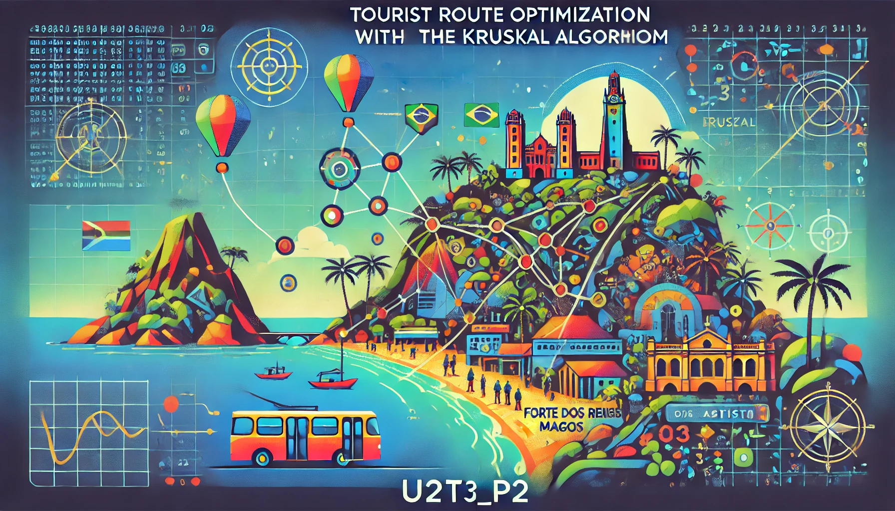
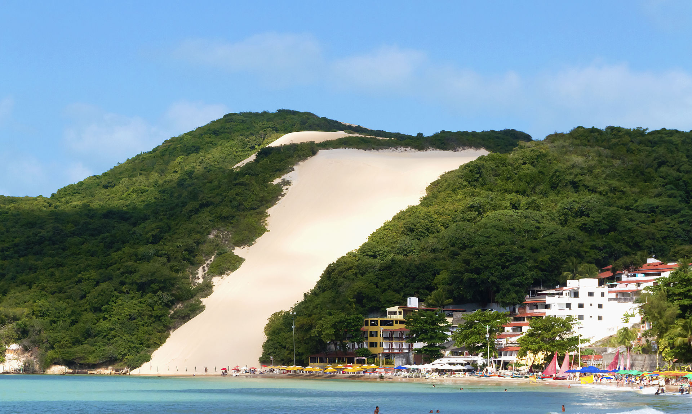
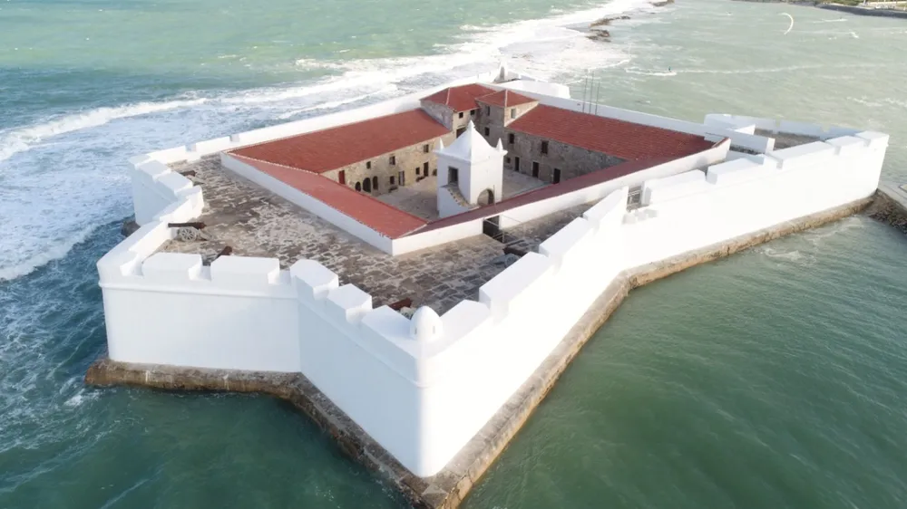
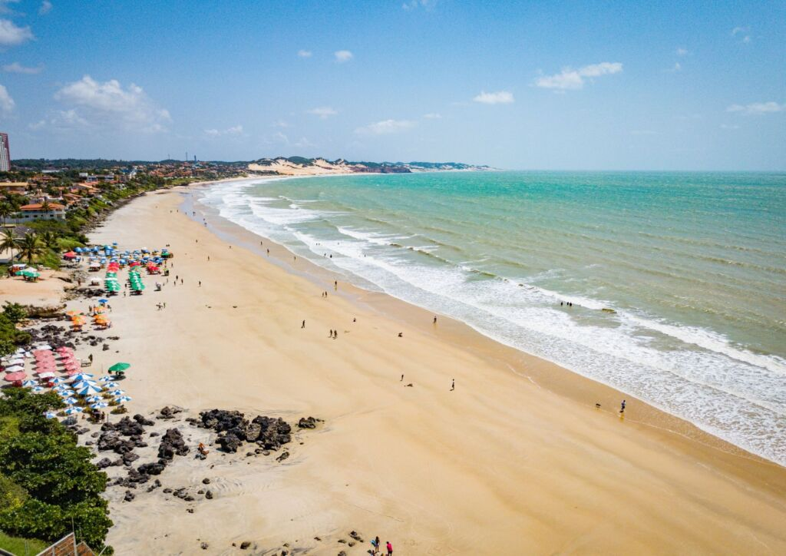
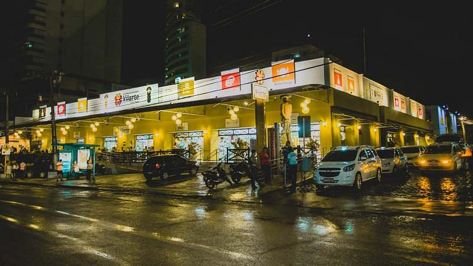
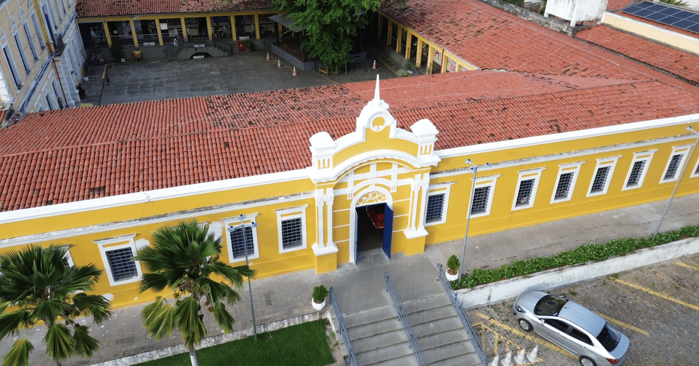
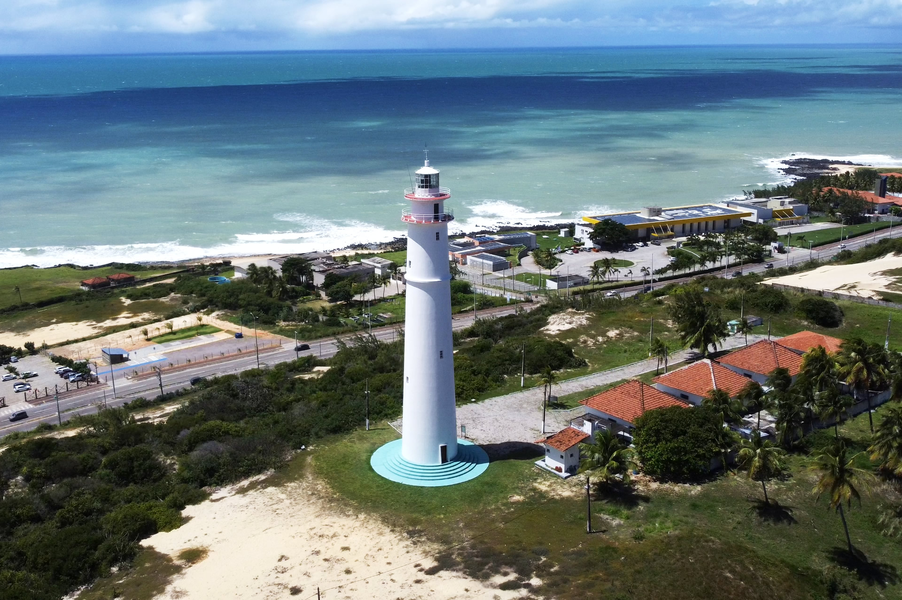
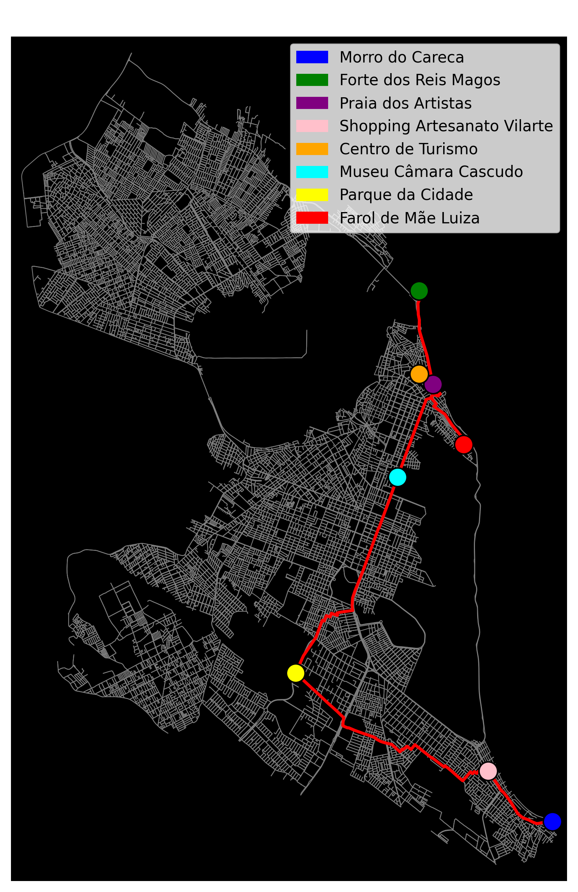

  
  
<em>Generated by DALL-E</em>

# Tourist Route Optimization with the Kruskal Algorithm

The main objective of this project is to illustrate and analyze the optimization of tourist routes in the city of Natal, Rio Grande do Norte, using Kruskal's algorithm to find the Minimum Spanning Tree (MST) among the city's tourist attractions. This helps determine the most efficient routes in terms of distance, connecting points of interest such as Morro do Careca, Forte dos Reis Magos, and other landmarks, promoting a practical approach to travel planning or urban logistics.

Student: Lucas Freire Costa

Course: Computer Engineering

    

## Notebook Structure and Step-by-Step Description

### 1. Loading the Road Network and Converting the Graph

The project starts by importing essential libraries such as OSMnx, NetworkX, and Matplotlib for handling and visualizing graph data. Using OSMnx, the road network of Natal (RN, Brazil) is retrieved directly from OpenStreetMap. The network is filtered by the "drive" type to focus on roads accessible to vehicles.

The downloaded graph is initially a directed MultiDiGraph, representing road directions. To simplify route calculations, the graph is converted into an undirected MultiGraph using a custom function. This transformation ensures that all edges are bidirectional, making it easier to compute distances and paths between points of interest.

### 2. Defining Points of Interest (POIs)

Below is a description of the Points of Interest (POIs) selected for this project. These landmarks are popular tourist attractions in Natal, Rio Grande do Norte, Brazil, known for their historical, cultural, and natural significance:

- **Morro do Careca**  
  A stunning sand dune located in Ponta Negra Beach, it is one of the most iconic landmarks of Natal. The dune is surrounded by lush vegetation, offering a picturesque view. Although climbing is prohibited to preserve the environment, it remains a must-see attraction for its natural beauty.

  
  
<em>Figure 1: Morro do careca</em>

- **Forte dos Reis Magos**  
  This historic fortress, shaped like a star, is located at the mouth of the Potengi River. Built in the 16th century, it served as a strategic defense point for the city. Visitors can explore its walls, corridors, and learn about its rich history.

  
  
<em>Figure 2: Forte dos Reis Magos</em>

- **Praia dos Artistas**  
  Known for its vibrant atmosphere, Praia dos Artistas (Artists’ Beach) is a popular destination for both locals and tourists. It features a beautiful coastline, bustling nightlife, and artisan markets, making it a cultural hub of Natal.

  
  
<em>Figure 3: Praia dos artistas</em>

- **Shopping Artesanato Vilarte**  
  A charming artisan market located near Ponta Negra. It showcases a variety of locally crafted goods, including souvenirs, jewelry, and textiles. It's an excellent spot for visitors to experience the local culture and purchase unique handmade items.

  
  
<em>Figure 4: Shopping Artesanato Vilarte</em>

- **Centro de Turismo**  
  A historical building that now serves as a cultural and craft center. It houses various artisan shops, art galleries, and a small museum. The Centro de Turismo is a great place to explore Natal's artistic heritage and enjoy local cuisine.

  
  
<em>Figure 5: Centro de Turismo</em>

- **Museu Câmara Cascudo**  
  Named after the famous Brazilian folklorist Luís da Câmara Cascudo, this museum features exhibits on anthropology, history, and culture. It offers an insightful glimpse into the traditions and lifestyle of the region.

  
  
<em>Figure 6: Museu Câmara Cascudoa</em>

- **Parque da Cidade**  
  A large urban park designed by Oscar Niemeyer, it serves as a green retreat in the city. The park includes walking trails, picnic areas, and a prominent observation tower that offers panoramic views of Natal.

  
  
<em>Figure 7: Parque da Cidade</em>

- **Farol de Mãe Luiza**  
  A lighthouse located in the Mãe Luiza neighborhood, it provides a stunning view of the Atlantic Ocean and Natal's coastline. It is a symbol of maritime heritage and a perfect spot for photography enthusiasts.

  
  
<em>Figure 8:Farol de Mãe Luiza</em>

### 3. Finding Nearest Nodes, Building the Graph, and Calculating the MST

The process begins by associating each tourist attraction with its closest node in Natal's road network graph. Using OSMnx's `nearest_nodes` function, the latitude and longitude of each point of interest (POI) are mapped to the corresponding graph node, ensuring a realistic connection to the city's road network.

Next, a complete graph is constructed where each node represents a POI, and the edges represent the shortest road distance between them. This is achieved by calculating the shortest path between every pair of POIs using NetworkX's `shortest_path` function with road length as the weight. The total distance for each path is then computed and assigned as the edge weight in the new graph.

Finally, Kruskal's algorithm is applied to this complete graph to compute the Minimum Spanning Tree (MST). The MST connects all POIs with the minimal total road distance, providing an efficient itinerary for visiting all attractions. The total length of the MST is also calculated, giving a measure of the optimized route's efficiency.

### 4. Visualization

Based on the graph generated from the road network of the city of Natal, it was possible to calculate the **Minimum Spanning Tree (MST)** connecting the main selected tourist spots. The image illustrates the obtained results:

- The background graph represents the complete road network of the city, where each gray line indicates a road.
- The highlighted points on the graph represent the **Points of Interest (POIs)**, which were associated with the closest nodes in the road network:
   - **Morro do Careca** (blue),
   - **Forte dos Reis Magos** (green),
   - **Praia dos Artistas** (purple),
   - **Shopping Artesanato Vilarte** (pink),
   - **Centro de Turismo** (orange),
   - **Museu Câmara Cascudo** (cyan),
   - **Parque da Cidade** (yellow),
   - **Farol de Mãe Luiza** (red).

- The routes highlighted in **red** represent the shortest paths between the tourist spots that are part of the MST. These paths were calculated using road length as the weight metric.

- Considering the tourist flow in the city, it is likely that the route begins in the **Ponta Negra** neighborhood, where the **Morro do Careca** is located. This neighborhood is traditionally where most tourists stay upon arriving in Natal, making it a strategic starting point for the routes.

This analysis allows for an understanding of the connectivity between Natal's points of interest, optimizing routes for tourism or logistics. The total length of the minimum spanning tree was calculated to be **24047 meters**.

  
  
<em>Figure 9: Graph with the MST</em>

