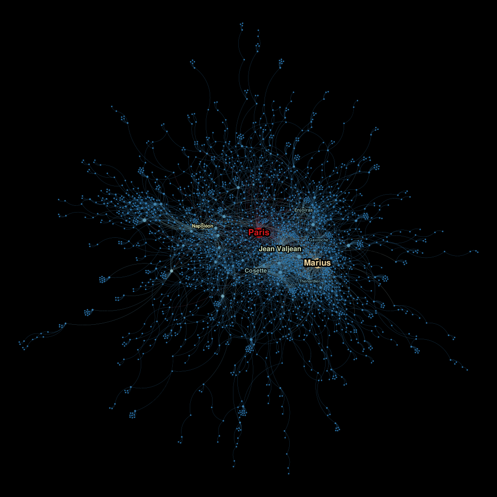
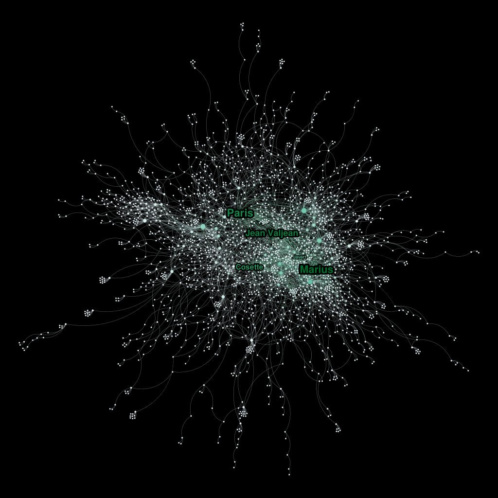

  
  
<em>Generated by DALL-E</em>

# From Victor Hugo to Interactive Graphs: A Journey with NLP and Network Tools

The objective is explore linguistic relationships and create a solution complete, ranging from text analysis to placement 
in producing an interactive graph, with detailed documentation in an article on Medium.

Students: Lucas Freire Costa

Course: Computer Engineering

[Medium article of the project](https://medium.com/@lucas.freire.705/from-victor-hugo-to-interactive-graphs-a-journey-with-nlp-and-network-tools-f13b992e7259)

[Podcast-English Version](https://open.spotify.com/episode/5kUkGX6cPjyg0kVzjhJb0D?si=dea1729c23b34ef6)

[Podcast-Portuguese Version](https://open.spotify.com/episode/5pRAL1ZCJ72fywKyEc0uZi?si=c8329908fcce49d9)

Les Misérables, by Victor Hugo, is one of the greatest works of world literature, a timeless classic that combines remarkable individual narratives with a profound social analysis of 19th-century France. Published in 1862, the novel addresses universal themes such as justice, redemption, and the struggle for human dignity, introducing unforgettable characters like Jean Valjean and Cosette. With meticulous detail, Victor Hugo constructs a panorama that transcends its time, delivering social critiques that remain relevant to this day.

In this sense, my goal is to explore the linguistic relationships in the texts of the 5 volumes written by Victor Hugo: Fantine, Cosette, Marius, The Idyll in the Rue Plumet and the Epic in the Rue St. Denis, and Jean Valjean. To do this, I performed natural language processing on the texts, created a graph, and analyzed various metrics.

## 1. Natural Language Processing
The texts were obtained from the Project Gutenberg and loaded into a Jupyter Notebook. From there, I performed various treatments, such as removing texts that were not part of the story and unwanted characters due to text formatting. It is worth noting that the texts in French were chosen to add more authenticity to the analysis.

Then, two analyses were performed: Pos-Tagging and NER. For this, the largest French model available in the spaCy library was chosen. The construction of this data was based on the analysis of sentences. In other words, the desired PoS or entities were extracted from each sentence. The first analysis performed was Pos-Tagging, and it was also where the first problem arose. The original idea was to perform Pos-Tagging with the NNP tag (Proper Noun, singular). The issue is that the tagger component is not available in the French spaCy model. On the other hand, there is the Morphologizer component, which is relatively similar to tagger, but more complex. So, the PROPN tag was chosen for Pos-Tagging, which also presented problems. I’m not sure if it’s due to the complexity of the language or defects in the model, but names like ‘Charles-François’ were identified as three different proper nouns, instead of just one.

For NER, the original idea was to limit it to just 3 types of entities: PERSON, ORG, and GPE. However, for the French model, the GPE entity was not available, so the LOC entity was used instead. Overall, Volume 1 had 489 sentences, Volume 2 had 645, Volume 3 had 596, Volume 4 had 791, and Volume 5 had 698. Adding up all the volumes, we have 3219 sentences.

## 2. Converting entities into network
The idea for constructing the network was that each entity would represent a node. There would be an edge between the nodes if they appeared in the same sentence. This part of the project required some preprocessing, such as removing duplicates and using the rapidfuzzy library to minimize errors stemming from natural language processing, such as differentiating identical names due to extra spaces—for example, "Jean_Valjean" and "Jean__Valjean." Additionally, the network had hundreds of weakly connected components, forming isolated islands with a few nodes that hindered the analysis. To address this, all connected components with fewer than 10 nodes were filtered out, leaving only one strongly connected component with 2,290 nodes and 3573 edges.

## 3. Network analysis and results
Initially, some centrality metrics were observed, such as degree centrality and betweenness centrality.

1. **Degree Centrality**: The node size represents the number of direct neighbors (*degree*).  
2. **Betweenness Centrality**: Indicates the nodes that act as bridges in the network.  

The node size is proportional to its degree, and the visualization layout used was *Force Atlas 2*. Warmer colors indicate higher metric values for the corresponding nodes.  

  
  
<em>Figure 1: Degree Centrality </em>

The characters Jean Valjean, Marius, Napoléon, and Cosette, as well as the city of Paris, were the entities that stood out the most in terms of degree centrality. These nodes have a high number of connections with others, suggesting that they are names frequently associated with other characters or events, making them essential points of interaction within the context of the work.

  
  
<em>Figure 2: Betweenness Centrality </em>

In the analysis of degree centrality and betweenness centrality, the entities that stood out the most were Paris, Marius, and Jean Valjean. Paris stood out primarily in betweenness centrality, indicating its crucial role as an intermediary, connecting various parts of the plot and other characters. Marius and Jean Valjean also showed high centrality, reflecting their importance in interacting with various entities and events. These metrics highlight the centrality of these characters and the city of Paris in the network, emphasizing their essential role in shaping relationships and driving the development of the story.

  
  
<em>Figure 3: Hubs </em>

Another analysis conducted was that of the network hubs. The identification of hubs in the network confirms the results of the centrality analyses performed. Characters such as Jean Valjean and Marius, as well as the city of Paris, emerge as hubs, reinforcing their crucial importance in the plot of Les Misérables, serving as bridges to other characters and events. This reinforces the idea that these entities play a fundamental role in connecting different parts of the story and influencing the relationships within the work.

The image below shows the core decomposition of the network. It is possible to observe the appearance of new names, in addition to those already mentioned, such as Napoléon, Enjolras, and Gavroche. The size of the node represents its degree, meaning the larger the node, the higher its degree. This analysis highlights the identification of more cohesive subgroups within the network, with these new entities emerging as more interconnected in the context of the plot.

By observing the core decomposition, we can see that these new names are part of the central substructures of the network, further reinforcing their roles as key players in the narrative. The nodes with a higher degree are those that interact more frequently with other entities, indicating their significance in connecting various parts of the story.

  
  
<em>Figure 4: Core </em>

## Part 3: Network production

The network has been put into production, enabling a deeper and more interactive analysis of the relationships between entities. The network’s communities were identified and divided using the modularity optimization algorithm proposed by Vincent D. Blondel, Jean-Loup Guillaume, Renaud Lambiotte, and Etienne Lefebvre in their work Fast unfolding of communities in large networks (Journal of Statistical Mechanics: Theory and Experiment, 2008). This algorithm detects communities by maximizing the modularity metric, effectively grouping nodes that are more densely connected to each other than to the rest of the network. The implementation of the network into production provides a dynamic visualization, allowing for a richer and more accessible exploration of interactions.

[Link to the network](https://lucasfreirec.github.io/datastructure/U3/network/)
